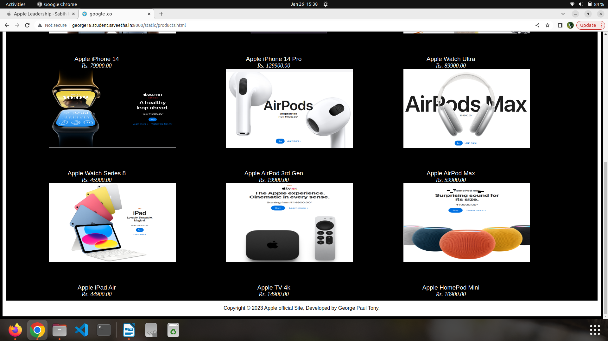

# Web Design for a Software Product Company

## AIM:

To design a static website for a software product company company.

## DESIGN STEPS:

### Step 1:

Requirement collection.

### Step 2:

Creating the layout using HTML and CSS.

### Step 3:

Updating the sample content.

### Step 4:

Choose the appropriate style and color scheme.

### Step 5:

Validate the layout in various browsers.

### Step 6:

Validate the HTML code.

### Step 6:

Publish the website in the given URL.

## PROGRAM :

### Home.html:

```
<!DOCTYPE html>
<html lang="en">
  <head>
    <title>Apple Inc.</title>
    <link rel="stylesheet" href="./css/layout.css" />
    <link rel="icon" href="./img/icon.png" type="image/x-icon" />
  </head>

  <body>
    <div class="banner"></div>
    <div class="container">
      <div class="menu">
        <div class="menuitemselected"><a href="/static/home.html">Home</a></div>
        <div class="menuitem"><a href="/static/products.html">Products</a></div>
        <div class="menuitem"><a href="/static/people.html">People</a></div>
        <div class="menuitem"><a href="/static/contact.html">Contact Us</a></div>
      </div>
      <div class="content">
        <div class="homecontent">
          <h1>Apple(India)</h1>
          
          <div class="contenttext">
            Apple Inc. is an American multinational technology company headquartered in Cupertino, California, United States. Apple is the largest technology company by revenue (totaling US$365.8 billion in 2021) and, as of June 2022, is the world's biggest company by market capitalization, the fourth-largest personal computer vendor by unit sales and second-largest mobile phone manufacturer. It is one of the Big Five American information technology companies, alongside Alphabet (Google), Amazon, Meta (Facebook), and Microsoft. 
            <br>
            Apple was founded as Apple Computer Company on April 1, 1976, by Steve Wozniak, Steve Jobs and Ronald Wayne to develop and sell Wozniak's Apple I personal computer. It was incorporated by Jobs and Wozniak as Apple Computer, Inc. in 1977 and the company's next computer, the Apple II, became a best seller and one of the first mass-produced microcomputers.
            <br>
            Apple went public in 1980 to instant financial success. The company developed computers featuring innovative graphical user interfaces, including the 1984 original Macintosh, announced that year in a critically acclaimed advertisement.
            <br>
            <ul>
              <li>Apple only makes a product if Apple can do it better</li>
              <li>Apple stays at least two years ahead of its competitors</li>
              <li>Keep things simple</li>
              <li>Anywhere, anytime and secure access</li>
              <li>The products have to be easy to use</li>
              <li>For any product that Apple creates, the people who create it have to want it themselves</li>
            </ul>
            <div class="footer">
                Copyright &#169; 2023 Apple official Site, Developed by George Paul Tony.
            </div>
          </div>
        </div>
      </div>
    </div>
  </body>
</html>
```

### Product.html:

```
<!DOCTYPE html>
<html lang="en">
  <head>
    <title>google .co</title>
    <link rel="stylesheet" href="./css/layout.css" />
    <link rel="icon" href="./img/icon.png" type="image/x-icon" />
  </head>

  <body>
    <div class="container">
      <div class="menu">
        <div class="menuitem"><a href="/static/home.html">Home</a></div>
        <div class="menuitemselected">
          <a href="/static/products.html">Products</a>
        </div>
        <div class="menuitem"><a href="/static/people.html">People</a></div>
        <div class="menuitem"><a href="/static/contact.html">Contact Us</a></div>
      </div>
      <div class="content">
        <div class="productcontent">    
          <h1>Our Premium Products</h1>
          <div class="productitems">
              <div class="productitem"> 
                  <div class="itemimage">
                  
                  </div>
                  <div class="itemname">Apple MacBook Pro</div>
                  <div class="itemprice">Rs.199900.00</div>
              </div>
              <div class="productitem"> 
                  <div class="itemimage">
                  
                  </div>
                  <div class="itemname">Apple Mac Mini</div>
                  <div class="itemprice">Rs. 59900.00</div>
              </div>
              <div class="productitem"> 
                  <div class="itemimage">
                  
                  </div>
                  <div class="itemname"> Apple iPad Pro with M2</div>
                  <div class="itemprice">Rs. 81900.00</div>
              </div>
              <br>
              <div class="productitem"> 
                  <div class="itemimage">
                  
                  </div>
                  <div class="itemname">Apple iPhone 14</div>
                  <div class="itemprice">Rs. 79900.00</div>
              </div>
              <div class="productitem"> 
                  <div class="itemimage">
                  
                  </div>
                  <div class="itemname">Apple iPhone 14 Pro</div>
                  <div class="itemprice">Rs. 129900.00</div>
              </div>
              <div class="productitem"> 
                  <div class="itemimage">
                  
                  </div>
                  <div class="itemname">Apple Watch Ultra</div>
                  <div class="itemprice">Rs. 89900.00</div>
              </div>
              <br>
              <div class="productitem"> 
                  <div class="itemimage">
                  
                  </div>
                  <div class="itemname">Apple Watch Series 8</div>
                  <div class="itemprice">Rs. 45900.00</div>
              </div>
              <div class="productitem"> 
                  <div class="itemimage">
                  
                  </div>
                  <div class="itemname">Apple AirPod 3rd Gen</div>
                  <div class="itemprice">Rs. 19900.00</div>
              </div>
              <div class="productitem"> 
                  <div class="itemimage">
                  
                  </div>
                  <div class="itemname">Apple AirPod Max</div>
                  <div class="itemprice">Rs. 59900.00</div>
              </div>
              <br>
              <div class="productitem"> 
                  <div class="itemimage">
                  
                  </div>
                  <div class="itemname">Apple iPad Air</div>
                  <div class="itemprice">Rs. 44900.00</div>
              </div>
              <div class="productitem"> 
                  <div class="itemimage">
                  
                  </div>
                  <div class="itemname">Apple TV 4k</div>
                  <div class="itemprice">Rs. 14900.00</div>
              </div>
              <div class="productitem"> 
                  <div class="itemimage">
                  
                  </div>
                  <div class="itemname">Apple HomePod Mini</div>
                  <div class="itemprice">Rs. 10900.00</div>
              </div>
          </div>
          </div>        
      </div>
      <div class="footer">
        Copyright &#169; 2023 Apple official Site, Developed by George Paul Tony.
      </div>
    </div>
  </body>
</html>
```

### People.html:

```
<!DOCTYPE html>
<html lang="en">
  <head>
    <title>google .co</title>
    <link rel="stylesheet" href="./css/layout.css" />
    <link rel="icon" href="./img/icon.png" type="image/x-icon" />
  </head>

  <body>
    <div class="container">
      <div class="menu">
        <div class="menuitem"><a href="/static/home.html">Home</a></div>
        <div class="menuitem"><a href="/static/products.html">Products</a></div>
        <div class="menuitemselected">
          <a href="/static/people.html">People</a>
        </div>
        <div class="menuitem"><a href="/static/contact.html">Contact Us</a></div>
      </div>
      <div class="content">
        <div class="peoplecontent">    
          <h1>Apple Leadership</h1>
        </div>
          <div class="peopleitems">
              <div class="peopleitem"> 
                  <div class="itemimage">
                  
                  </div>
                  <div class="itemname">CEO</div>
                  <div class="itemprice">[Tim Cook]</div>
              </div>
              <div class="peopleitem"> 
                  <div class="itemimage">
                  
                  </div>
                  <div class="itemname">Senior Vice President and General Counsel</div>
                  <div class="itemprice">[Katherine Adams]</div>
              </div>
              <div class="peopleitem"> 
                  <div class="itemimage">
                  
                  </div>
                  <div class="itemname">Senior Vice President Services</div>
                  <div class="itemprice">[Eddy Cue]</div>
              </div>
              <div class="peopleitem"> 
                  <div class="itemimage">
                  
                  </div>
                  <div class="itemname">Senior Vice President Software Engineering</div>
                  <div class="itemprice">[Craig Federighi]</div>
              </div>
              <div class="peopleitem"> 
                  <div class="itemimage">
                  
                  </div>
                  <div class="itemname">Chief Operating Officer</div>
                  <div class="itemprice">[Jeff Williams]</div>
              </div>
              <div class="peopleitem"> 
                  <div class="itemimage">
                  
                  </div>
                  <div class="itemname">Senior Vice President Operations</div>
                  <div class="itemprice">[Sabih Khan]</div>
              </div>
          </div>
          </div>        
      </div>
      <div class="footer">
        Copyright &#169; 2023 Apple official Site, Developed by George Paul Tony.
      </div>
    </div>
  </body>
</html>
```

### Contact.html:

```
<!DOCTYPE html>
<html lang="en">
  <head>
    <title>Google .co</title>
    <link rel="stylesheet" href="./css/layout.css" />
    <link rel="icon" href="./img/icon.png" type="image/x-icon" />
  </head>

  <body>
    <div class="container">
      <div class="menu">
        <div class="menuitem"><a href="/static/home.html">Home</a></div>
        <div class="menuitem"><a href="/static/products.html">Products</a></div>
        <div class="menuitem"><a href="/static/people.html">People</a></div>
        <div class="menuitemselected">
          <a href="/static/contact.html">Contact Us</a>
        </div>
      </div>
      <div class="content">
        <div class="contactcontent">
          <h1>Contact Details</h1>
          <div class="contenttext">
              <p>
                  Apple Manufacturing India,<br> 
                  Chennai, Old Mahabalipuram Road, <br>
                  Chennai 600 002, India<br>
                  Customer Care:0008000401966<br>
                </p>
                
                <hr>
              <ul type='square'>
              <hr size="4" width="3">
              <li>Contact no: +916380887588 /+916380777577</li><br>
              <li>Email id: googleindia@gmail.com</li>
            </ul>
            <p>You may also contact us through ....</p>
            <ul>
                <li>Facebook</li>
                <li>Twitter</li>
                <li>Instagram</li>
                <li>WhatsApp</li>
                <li>LinkdIn</li>
            </ul>
                    
          </div>
        </div>
      </div>
      <div class="footer">
        Copyright &#169; 2023 Apple official Site, Developed by George Paul Tony.
      </div>
    </div>
  </body>
</html>
```

### Layout.css:

```
* {
  box-sizing: border-box;
  font-family: Arial, Helvetica, sans-serif;
}
body {
  background-color: black;
  color:white;
}
.container {
  width: 100%;
  margin-left: auto;
  margin-right: auto;
  border-width: 5px 5px 5px 5px;
  border-style: solid;
}

.banner {
  display: block;
  width: 20%;
  height: 100px;
  text-align: center;
  font-size: 10px;
  background-image: url("/static/image/app.png");
  background-size: 100% 100%;
  margin: 0px 0px 0px 0px;
  padding-top: 150px;
  color: #2e2e2e;
}

.menu {
  display: block;
  width: 100%;
  height: 50px;
  font-size: larger;
  background-color:rgb(59, 59, 59);
  text-align: center;
  padding-top: 15px;
  margin: 0px 0px 0px 0px;
  border-width: 1px;
}

.menuitem {
  display: inline-block;
  margin-left: 10px;
  margin-right: 10px;
}
.menuitemselected {
  display: inline-block;
  margin-left: 10px;
  margin-right: 10px;
  color: lightskyblue;
}

.menuitem a {
  text-decoration: none;
  color:white;
}

.content {
  display: block;
  width: 100%;
  background-color: #000000;
  min-height: 500px;
  margin: 0px 0px 0px 0px;
  border-width: 5px;
  border-color:rgb(255, 255, 255);
  border-style: solid;
}
.homecontent {
  min-height: 550px;
  margin: 10px 10px 10px 10px;
}
.homecontent h1 {
  text-align: left;
  font-family: Cambria, Cochin, Georgia, Times, 'Times New Roman', serif;
  font-size: xx-large;
}
.homecontent img {
  float: right;
  width: 320px;
  height: 150px;
  margin-left: 10px;
}

.contenttext {
  text-align: justify;
  font-family: Cambria, Cochin, Georgia, Times, 'Times New Roman', serif;
  font-size: x-large;
  color: white;
}

.productcontent {
  min-height: 500px;
  margin: 10px 10px 10px 10px;
}

.productcontent h1 {
  text-align: left;
  font-family: Cambria, Cochin, Georgia, Times, 'Times New Roman', serif;
  font-size: xx-large;
}

.productitems {
  display: block;
}

.productitem {
  display: inline-block;
  width: 30%;
  height: 250px;
  text-align: center;
}

.productitem img {
  width: 400px;
  height: 250px;
  display: block;
}
.productitem .itemimage {
  display: block;
  margin-left: auto;
  margin-right: auto;
  width: 300px;
  margin-bottom: 70px;
}

.productitem .itemname {
  display: block;
  text-decoration: #310608;
  font-family: 'Lucida Sans', 'Lucida Sans Regular', 'Lucida Grande', 'Lucida Sans Unicode', Geneva, Verdana, sans-serif;
  font-size: larger;
  font-weight: 1000px;
}
.productitem .itemprice {
  display: block;
  font-family: Georgia, 'Times New Roman', Times, serif;
  font-style: italic;
  font-size: large;
}

.peoplecontent {
  min-height: 10px;
  margin: 10px 10px 10px 10px;
}

.peoplecontent h1 {
  text-align: left;
}

.peopletitems {
  display: block;
}

.peopleitem {
  display: inline-block;
  width: 30%;
  height: 250px;
  text-align: center;
}

.peopleitem img {
  width: 400px;
  height: 250px;
  display: block;
}
.peopleitem .itemimage {
  display: block;
  margin-left: auto;
  margin-right: auto;
  width: 300px;
  margin-bottom: 70px;
}

.peopleitem .itemname {
  display: block;
  text-decoration: #310608;
  font-family: 'Lucida Sans', 'Lucida Sans Regular', 'Lucida Grande', 'Lucida Sans Unicode', Geneva, Verdana, sans-serif;
  font-size: larger;
  font-weight: 1000px;
}
.peopleitem .itemprice {
  display: block;
  font-family: Georgia, 'Times New Roman', Times, serif;
  font-style: italic;
}
.contactcontent {
  min-height: 550px;
  margin: 10px 10px 10px 10px;
}
.contactcontent h1 {
  text-align: left;
  font-family: Cambria, Cochin, Georgia, Times, 'Times New Roman', serif;
  font-size: xx-large;
}
.contactcontent img {
  float: center;
  width: 70px;
  height: 90px;
  margin-left: 10px;
}
.footer {
  display: block;
  width: 100%;
  height: 40px;
  background-color: #ffffff;
  text-align: center;
  padding-top: 10px;
  margin: 0px 0px 0px 0px;
  color: #000000;
}
```

## OUTPUT:

### Home Page:


### Product Page:




### People Page:


### Contact Page:


## Result:

Thus a website is designed for the software product company and the HTML,CSS code are validated.
